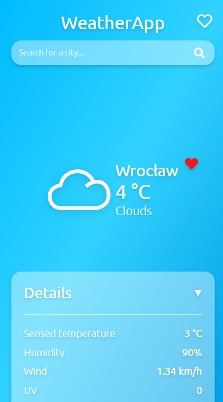
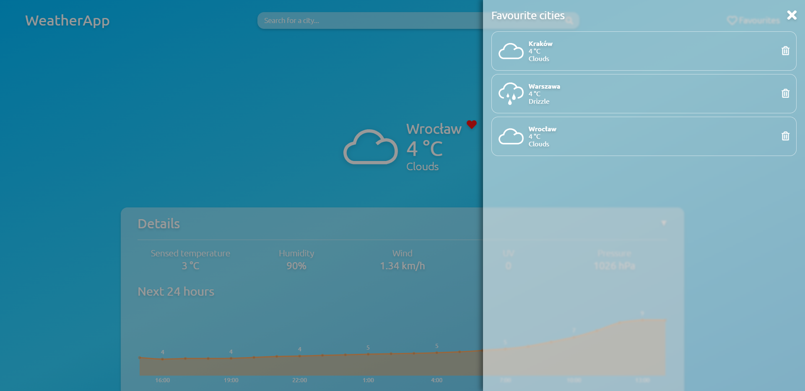
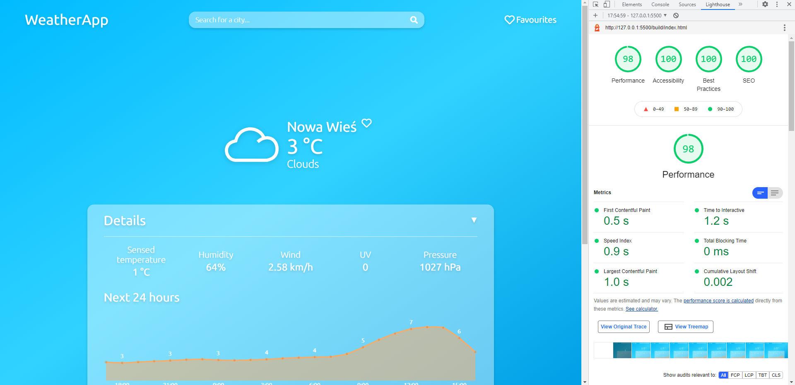

# WeatherApp

WeatherApp is my approach to a very popular "weather app" type of project. This version of my WeatherApp is a React rewrite of a previous [MVC pattern version](https://github.com/kacperbudny/WeatherApp-MVC). Additionaly to being a React rewrite, it also provides improved accessibility and good Lighthouse scores - see the screenshot below.

It uses OpenWeatherMap API.

## Features
* Displaying current weather data
* Graph with a weather forecast for the next 24 hours
* Displaying weather forecast for a next week
* List of favourite cities
* Using geolocation to get user's current city
* Remembering last seen city
* Fully responsive web app
* The website is accessible - it can be fully navigated using keyboard and screen readers 

## Screenshots




## Lighthouse audit score



## Setup
First you need to install packages using:
```
npm install
```

You also have to create .env file in the root directory with your own OpenWeatherMap API key, like: 
```
REACT_APP_API_KEY=your_key
```

The app is configured with Webpack in a way that just lets you open it with hot reload using:
```
npm start
```

## Technologies
* React
* TypeScript
* SCSS
* ESLint
* Prettier
* Chart.JS
* OpenWeatherMap API